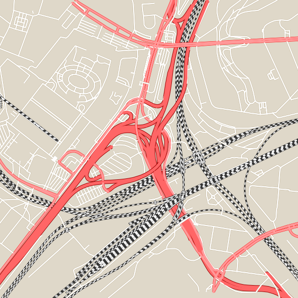

# Grouped rendering

Using "grouped rendering" on a layer renders all styles of one layer for all features that have the same value before proceeding to other features that have a different value.

This feature was added in <https://github.com/mapnik/mapnik/pull/916> and is first available in Mapnik v2.1.0.

Example syntax looks like:

```xml
<Layer srs=".." group-by="z">
    <StyleName>casing</StyleName>
    <StyleName>fill</StyleName>
    ...
</Layer>
```

This is useful for rendering roads in the correct z-order:

* The datasource (e.g. Postgres) sorts the data based on a field (e.g. z_order) into ascending order
* Mapnik paints the features as they come in, but stops when the next feature has a higher z-order than the current one. It then proceeds to paint other styles for the features it has retrieved so far.
* Once it's done rendering all styles for features with that z_order, it clears the memory cache and proceeds with the next higher z_order and paints all features etc.

Ideally this would work across layers, so all layers are sorted by a certain field (e.g. z_order) and across all layers, the features with the lowest z_order are painted first before proceeding to the next higher z_order features. Of course, that'd mean that we have to have every layer's datasource handles open during the entire rendering process.

With two styles and three features, the current rendering order is:

```
featureX[z=1]: styleA
featureY[z=2]: styleA
featureZ[z=3]: styleA
featureX[z=1]: styleB
featureY[z=2]: styleB
featureZ[z=3]: styleB
```

This feature would allow for this rendering order:

```
featureX[z=1]: styleA
featureX[z=1]: styleB
featureY[z=2]: styleA
featureY[z=2]: styleB
featureZ[z=3]: styleA
featureZ[z=3]: styleB
```

An example XML and sqlite file can be downloaded from [here](data/grouped-rendering-sample.zip).

Example of rendering from one layer without and with the `group-by` on z order:



