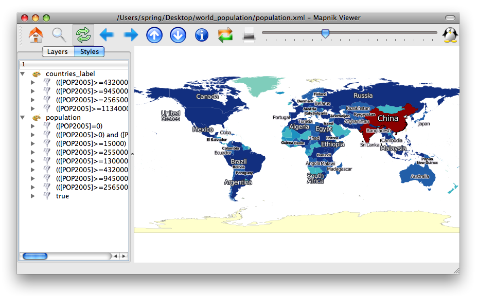

# Mapnik Viewer

The Mapnik Viewer is a GUI tool for rendering and viewing maps based on Mapnik XML mapfiles.

It's available in the `demo/viewer` folder of your mapnik source code. It is not compiled by default, but can be built separately after installing Mapnik.

----

----

## Requirements

 * A working Mapnik installation
 * A Mapnik XML file to view
 * Qt4 including dev files (for example, see [Qt/Mac Open Source Edition](http://trolltech.com/developer/downloads/qt/mac))
 * Qmake

## Building

NOTE: these instructions assume you are using Mapnik >= 2.1. Mapnik 2.1 source code includes a `viewer.pro` file that will leverage the `mapnik-config` to get the proper build settings from your Mapnik install.

Run Qmake to generate a makefile:

```sh
cd ./demo/viewer
qmake -makefile
```

On Mac OSX the above command may generate an XCode project. To generate a normal Makefile do:

```sh
qmake -spec macx-g++
```

Finally, run Make to build the *viewer.app* or *viewer.exe*

```sh
make
```

On OS X, if a viewer.xcodeproj was built then open the project in Apple's XCode environment and hit "build and run"

## Usage

Double click on the resulting application (viewer.app on Mac OS)

 * You can then load map files from the file menu (make sure you have absolute paths set to datasources).
 * Hit the *Home* button to zoom to the data extent.
 * The rest should be obvious.

You can also load your XML files when launching the viewer from a terminal:

```sh
# On linux this would look like:
./viewer /path/to/your.xml
# On mac this would look like:
./viewer.app/Contents/MacOS/viewer /path/to/your.xml
# or
open -a viewer
```

or

```sh
    # ./viewer your.xml -1,50,1,52
```

## Register plugins directory
Plugin directory is default to /usr/local/lib/mapnik/input/  
To override it: create a viewer.ini file for example:

```ini
[mapnik]
plugins_dir=/usr/lib/mapnik/3.0/input/ 
```
