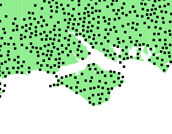
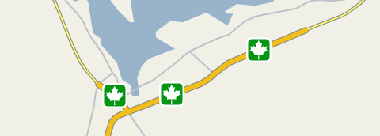
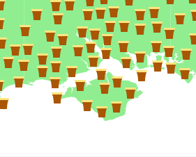
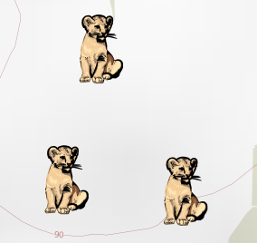
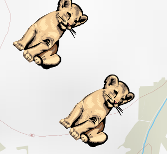

# Point Symbolizer

<!-- Name: PointSymbolizer -->
<!-- Version: 19 -->
<!-- Last-Modified: 2011/03/02 01:02:42 -->
<!-- Author: Ldp -->
[Symbolizer](SymbologySupport) that specifies rendering of a png, tiff, or svg graphic symbol at a point.

To combine a graphic symbol with a text label, use a [ShieldSymbolizer](ShieldSymbolizer). If you want to change the image offset, use a [MarkersSymbolizer](MarkersSymbolizer).

 



## Configuration Options

Some options described here are not available in mapnik versions < 2.0.

| *parameter* | *value*  | *default* | *accepts expressions* |
--------------|---------|-----------|-----------------------|
| file    |  path to image file | none | mapnik >= 2.0 | 
| width **(removed)** | px | 4 | |
| height **(removed)** | px | 4 | |
| type **(removed)** | png tiff svg | none | |
| allow-overlap | allow text to overlap the point image; true/false | false | no |
| opacity | Opacity of the symbolizer: 0.0 - 1.0 | 1.0 |  no |
|   transform    |   [SVG transform](http://www.w3.org/TR/SVG/coords.html#TransformAttribute) | identity | mapnik >= 3.0<br>you have to specify transform, but you can use expressions for its parameters, e.g. `"rotate([value1]) scale([value2])"` |
|   ignore-placement | allow subsequent point/shield symbolizers to overlap this symbol; true/false | false | no |
| comp-op | [Compositing](Compositing) | none | no |

## Examples

### Default

#### XML

```xml
<PointSymbolizer/> 
```

#### Python

```python
sym = PointSymbolizer()
```

#### C++

```cpp
using mapnik::point_symbolizer;
point_symbolizer sym;
```
    
### Image label
    


#### XML

```xml
    <PointSymbolizer file="/tmp/pub.png" transform="scale(2)" /> 
```

#### Python

```python
sym = PointSymbolizer("/tmp/pub.png", "png", 16, 16)
# args are file, type, height, width
sym.allow_overlap = True
sym.opacity = .5
```

#### C++
 
```cpp
using mapnik::point_symbolizer;
point_symbolizer sym("/tmp/pub.png","png",16,16);
```

### Allow Overlap


#### XML

```xml
<PointSymbolizer allow-overlap="yes" file="/Users/artem/projects/ 
openstreetmap/mapnik/symbols/station_small.png" />
```

### Do Not Allow Overlap


#### XML

```xml
<PointSymbolizer allow-overlap="no" file="/Users/artem/projects/ 
openstreetmap/mapnik/symbols/station_small.png" />
```

## SVG symbols (trunk)



```xml
<PointSymbolizer file="/Users/artem/Desktop/svg/lion.svg" opacity="1.0" transform="scale(0.2,0.2)" />
```



```xml
<PointSymbolizer file="/Users/artem/Desktop/svg/lion.svg" opacity="1.0" transform="rotate(45) scale(0.4,0.4)" />
```
