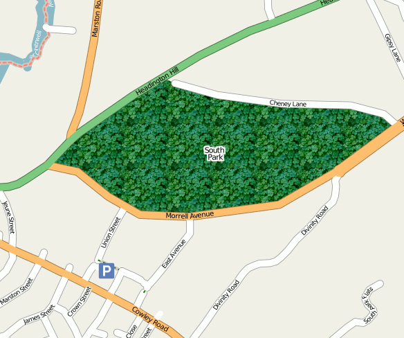

# PolygonPattern Symbolizer

<!-- Name: PolygonPatternSymbolizer -->
<!-- Version: 8 -->
<!-- Last-Modified: 2011/10/14 08:15:29 -->
<!-- Author: floledermann -->
[Symbolizer](SymbologySupport) that specifies rendering of an area enclosed by a polygon filling it with a repeated tiff, png, or svg image. An alternative to a [PolygonSymbolizer](PolygonSymbolizer).



## Configuration Options

| *parameter*          | *value*                    | *default* | *accepts expressions* |
| -------------------- | -------------------------- | --------- | --------------------- |
| file                 | path to image file         | none      | mapnik >= 2.0         |
| width **(removed)**  | px                         | 4         |                       |
| height **(removed)** | px                         | 4         |                       |
| type **(removed)**   | png tiff                   | none      |                       |
| comp-op              | [Compositing](Compositing) | none      | no                    |

## Examples

### Default

` FIXME: Add image `

#### XML

```xml
<PolygonPatternSymbolizer file="/path/to/icon.png"/>
```

#### Python

```python
p = PolygonPatternSymbolizer('/path/to/icon.png','png',10,10) # file, type, width, height
```

mapnik2:

```python
p = PolygonPatternSymbolizer(PathExpression('/path/to/icon.png'))
```

#### C++


```cpp
ruly_type rule;
rule.append(polygon_pattern_symbolizer("path/to/icon.png", "png", 20, 20)); // file, type, width, height
```